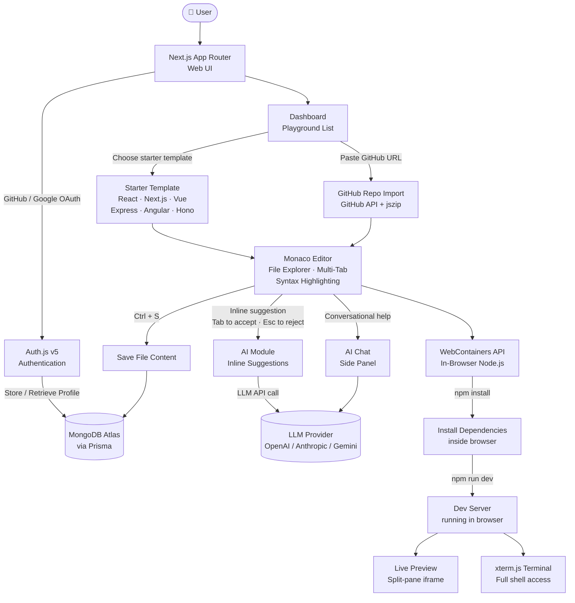

<h1 align="center">
  <br>
  ⚡ Vibecode Editor
  <br>
</h1>

<p align="center">
  A powerful, browser-based code editor with AI pair-programming, live WebContainer execution, and seamless GitHub integration — all running entirely in your browser.
</p>

<p align="center">
  
  
  
  
  
  
</p>

---

## ✨ Features

- **🤖 AI Thinking Module** — Inline AI code suggestions with a side-panel chat. Get completions as you type, accept with `Tab`, reject with `Esc`, or have a full conversation with the AI about your code.
- **⚙️ WebContainers (In-Browser Node.js)** — Run a real Node.js dev server entirely inside your browser tab using the WebContainers API. `npm install` and `npm run dev` run without any backend.
- **🖥️ Integrated Terminal** — A full xterm.js-powered terminal embedded in the editor. Run commands and see build output without leaving the app.
- **📦 GitHub Repository Import** — Import any public GitHub repository directly into a playground. Browse, edit, and run code instantly.
- **📁 File Explorer & Multi-Tab Editor** — Monaco Editor (the engine behind VS Code) with a full file tree, multi-tab support, syntax highlighting, and IntelliSense.
- **⭐ Playground Starring** — Star and organize your favorite playgrounds for quick access from the dashboard.
- **🔐 OAuth Authentication** — Secure sign-in via GitHub and Google OAuth powered by Auth.js v5.
- **🌙 Dark / Light Mode** — System-aware theming with manual toggle.

---

## 🧭 App Workflow



---

## 🛠️ Tech Stack

| Layer | Technology |
|---|---|
| **Framework** | [Next.js 16](https://nextjs.org) (App Router, React 19) |
| **Language** | [TypeScript 5](https://www.typescriptlang.org) |
| **Styling** | [Tailwind CSS 4](https://tailwindcss.com) + [shadcn/ui](https://ui.shadcn.com) |
| **Database ORM** | [Prisma 6](https://www.prisma.io) |
| **Database** | MongoDB Atlas |
| **Authentication** | [Auth.js v5](https://authjs.dev) (GitHub + Google OAuth) |
| **Editor** | [Monaco Editor](https://microsoft.github.io/monaco-editor/) |
| **In-Browser Runtime** | [WebContainers API](https://webcontainers.io) |
| **Terminal** | [xterm.js](https://xtermjs.org) |
| **State Management** | [Zustand](https://zustand-demo.pmnd.rs) |
| **Deployment** | [Vercel](https://vercel.com) |

---

## 🚀 Getting Started

### Prerequisites

- **Node.js** >= 18.x
- **npm** >= 9.x
- A **MongoDB Atlas** account (free tier works)
- A **GitHub OAuth App** and a **Google OAuth App**

### 1. Clone the Repository

```bash
git clone https://github.com/bazilurrb/vibecode_editor.git
cd vibecode_editor
```

### 2. Install Dependencies

```bash
npm install
```

### 3. Configure Environment Variables

```bash
cp .env.example .env
```

Open `.env` and fill in all required values. See [`.env.example`](.env.example) for descriptions of each variable.

### 4. Set Up the Database

#### Option A — MongoDB Atlas (Recommended)

1. Create a free cluster at [cloud.mongodb.com](https://cloud.mongodb.com)
2. Go to **Network Access** → add your IP (or `0.0.0.0/0` for dev)
3. Copy your connection string into `DATABASE_URL` in `.env`

Then push the schema:

```bash
npx prisma db push
```

To inspect your data visually:

```bash
npx prisma studio
```

### 5. Run the Dev Server

```bash
npm run dev
```

Open [http://localhost:3000](http://localhost:3000).

> **Important:** The WebContainers API requires cross-origin isolation headers (`COOP` + `COEP`). These are already set in `next.config.ts`. Always access the app via `http://localhost:3000` (not `127.0.0.1`) during development.

---

## 📁 Project Structure

```
vibecode_editor/
├── app/                    # Next.js App Router pages & API routes
│   ├── api/                # API route handlers
│   ├── dashboard/          # Playground dashboard
│   └── playground/[id]/    # Code editor page
├── features/               # Feature-based modules
│   ├── ai/                 # AI suggestion hooks
│   ├── ai-chat/            # AI chat side panel
│   ├── auth/               # Auth actions & components
│   ├── playground/         # Editor, file tree, hooks
│   └── webContainers/      # WebContainer & terminal logic
├── components/             # Shared UI components (shadcn/ui)
├── lib/                    # Prisma client & shared utilities
├── prisma/
│   └── schema.prisma       # Database schema
├── vibecode-starters/      # Built-in starter template files
├── auth.ts                 # Auth.js v5 main config
├── auth.config.ts          # OAuth provider definitions
├── middleware.ts            # Route protection
└── next.config.ts          # Next.js config (COOP/COEP headers)
```

---

## 🔑 OAuth Setup

### GitHub

1. [github.com/settings/developers](https://github.com/settings/developers) → **OAuth Apps** → **New OAuth App**
2. **Homepage URL**: `http://localhost:3000`
3. **Callback URL**: `http://localhost:3000/api/auth/callback/github`
4. Copy **Client ID** → `AUTH_GITHUB_ID`, generate **Secret** → `AUTH_GITHUB_SECRET`

### Google

1. [console.cloud.google.com](https://console.cloud.google.com) → **APIs & Services** → **Credentials** → **Create OAuth 2.0 Client ID**
2. **Authorized redirect URI**: `http://localhost:3000/api/auth/callback/google`
3. Copy **Client ID** → `AUTH_GOOGLE_ID`, **Secret** → `AUTH_GOOGLE_SECRET`

---

## 🚢 Deploying to Vercel

1. Push your repo to GitHub
2. Import into [Vercel](https://vercel.com)
3. Add all env vars from `.env.example` under **Settings → Environment Variables**
4. Set `AUTH_URL` to your production domain (e.g. `https://your-app.vercel.app`)
5. Add your production domain to the OAuth callback URLs in GitHub and Google

---

## 🤝 Contributing

Contributions are welcome! Please open an issue first to discuss changes.

1. Fork the repo
2. Create your branch: `git checkout -b feat/amazing-feature`
3. Commit: `git commit -m 'feat: add amazing feature'`
4. Push: `git push origin feat/amazing-feature`
5. Open a Pull Request

---

## 📄 License

MIT License — see [LICENSE](LICENSE) for details.

---

<p align="center">Built with ❤️ by <a href="https://github.com/bazilurrb">Bazil</a></p>
